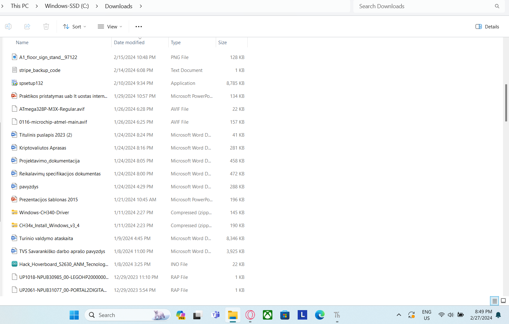
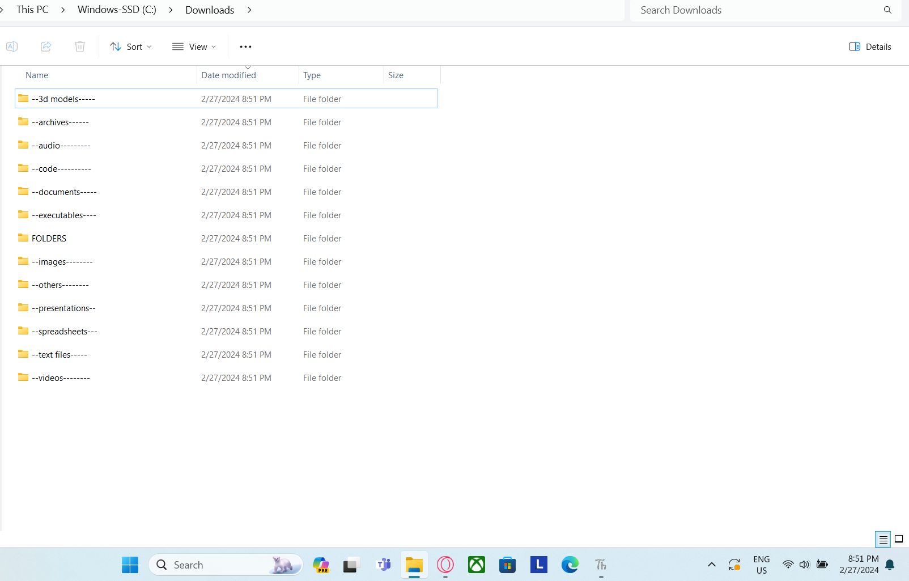

<!DOCTYPE html>
<html lang="en">
<head>
  <meta charset="UTF-8">
  <meta name="viewport" content="width=device-width, initial-scale=1.0">
  
</head>
<body>
  <h1>Tidy Downloads: A File Organizer for the Busy User</h1>
  
This Python script helps you conquer the clutter in your download folder! It automatically sorts your files into categorized folders based on their extensions, saving you time and keeping your downloads organized.

  <h2>Features</h2>
  <ul>
    <li>Effortless organization: No more manually sorting files!</li>
    <li>Customizable categories: Modify the script to match your specific needs.</li>
    <li>Clear output: See which files are moved and where they go.</li>
  </ul>

  <h2>Get started</h2>
  <ol>
    <li>Clone this repository using Git: <code>git clone https://download-directory.github.io/</code></li>
    <li>Install the required libraries: <code>pip install os shutil</code></li>
    <li>Update the <code>download_dir</code> variable in the script to point to your download folder.</li>
    <li>Run the script and watch your downloads get organized!</li>
  </ol>

  <h2>Before organizer:</h2>
  
  <h2>After organizer:</h2>
  

  
  <h2>Looking to contribute?</h2>
  
We welcome contributions to improve this script! Feel free to add new categories, enhance functionality, or suggest improvements. Fork the repository on <a href="https://download-directory.github.io/" target="_blank" rel="noopener noreferrer"><i class="fa fa-github"></i> GitHub</a> and send a pull request.

</body>
</html>
